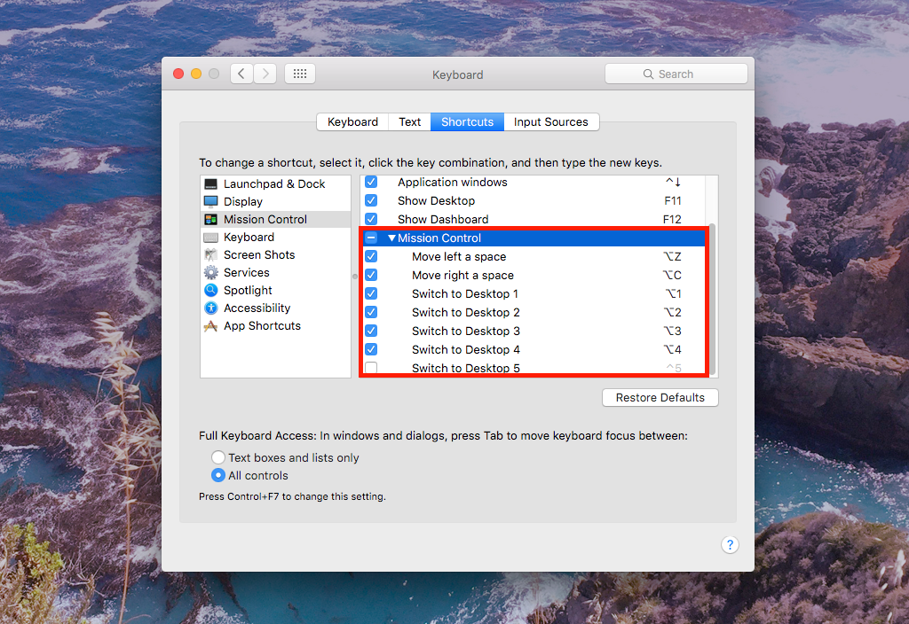

# OSX Setup
A list of things to do on a fresh install of OSX

## Run the script
Run [`osx-install.sh`](osx-install.sh).

This will perform a couple of different actions:
* Disable local Time Machine images
* Turn off Hibernation and Sleep
* Delete the Sleep image file
* Set `noatime`
* Set screenshots save location to `~/screenshots/` directory
* Move and symlink various folders to a secondary hardrive
* Install [Homebrew](https://brew.sh), [Homebrew Cask](https://caskroom.github.io) and various packages
* Install Perlbrew
* Clone this dotfiles directory and install config files with `stow`
* Move NPM global packages to the home directory
* Add _Base-16 Atelier Sulphurpool_ terminal theme

## Turn Caps Lock into the LALT key
Set up the Caps Lock key to act as ESC when pressed and Left ALT when held down.

1. First, if not already installed, get Seil and Karabiner:
    ```
    brew cask install seil karabiner
    ```
1. Set Caps Lock to **'No Action'** under  `System Preferences > Keyboard > Modifier Keys...`
1. In Seil, set Caps to keycode `80` (F19)
1. In Dotfiles, use `stow` to add `private.xml` in Karabiner:
    1. `cd ~/dotfiles/; stow karabiner`
    1. Reload and enable

Reference: [_A Modern Space Cadet_ by **Steven Losh**](http://stevelosh.com/blog/2012/10/a-modern-space-cadet/#hyper)


## Windows management with Chunkwm and Hotkeys with Skhd
[Chunkwm](https://github.com/koekeishiya/chunkwm) is used to manage application windows. [Skhd](https://github.com/koekeishiya/skhd) is used to map hotkeys that move, arrange, and resize windows.

## Hotkeys for switching spaces
Change default hotkeys for switching Mission Control spaces under `System Preferences > Keyboard > Shortcuts > Mission Control`:



## Set Java for Legacy Applications
**TODO**: write simple steps and script to perform the actions in the reference below:


#### Reference:
* https://apple.stackexchange.com/questions/180899/adobe-illustrator-cs6-with-java-8/180909#180909
* https://oliverdowling.com.au/2015/10/09/oracles-jre-8-on-mac-os-x-el-capitan/
